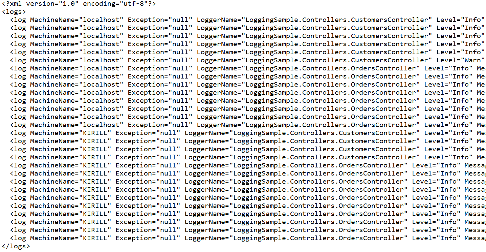

# workshopHW.Logging-audit

## Task: to finalize the project LoggingSample.

1) Add logging for all methods of customer and order controllers in the image of the customer / {customerId} method, which was made at the workshop.
When performing this task, you will need to refine the CustomerService and create the OrderService in the BLL project.

2) Write your log target, which will write logs to the xml file of the logs folder (the same folder where the text logs are currently being written)
Provide synchronization of threads that will write logs to this file.
Log data should be similar to the LogMessage class from the DAL project.
All logs should be written to the xml file starting from the INFO level, but not including the ERROR and FATAL levels.

## Short description

#### 1. XML logs

#### 2. Text logs

#### 3. Database logs

